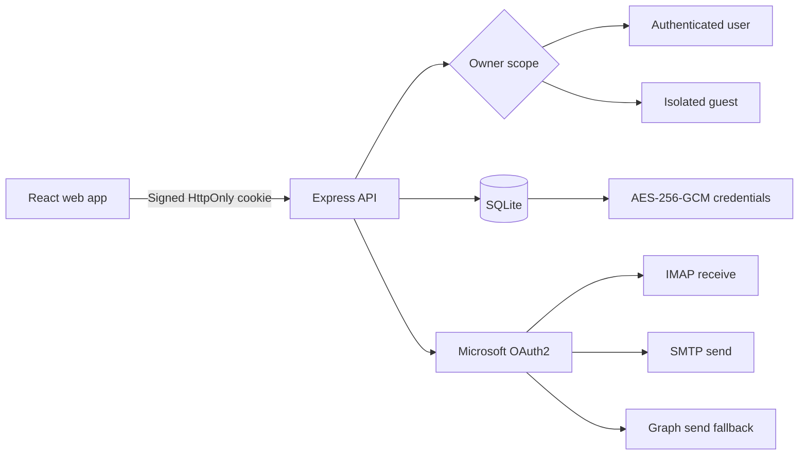

<p align="center">
  
</p>

<h1 align="center">Mail</h1>

<p align="center">
  A private, self-hosted workspace for managing Outlook, Hotmail, and Live mailboxes.
</p>

<p align="center">
  <a href="https://www.aillive.xyz/mail/"><strong>Live Demo</strong></a>
  ·
  <a href="README.zh-CN.md">简体中文</a>
  ·
  <a href="SECURITY.md">Security</a>
  ·
  <a href="CONTRIBUTING.md">Contributing</a>
</p>

<p align="center">
  
  
  
  
  
  
</p>


Mail brings receiving, reading, organizing, and sending email into one responsive web application. It combines Microsoft OAuth2, IMAP, SMTP, Microsoft Graph, and an owner-scoped SQLite data layer without sending mailbox credentials to a third-party service.

The interface is designed for desktop and mobile use, supports English and Chinese, includes light and dark themes, and provides a dedicated administration workspace for users, activity, and announcements.

## Why Mail

| | Capability | What it provides |
| --- | --- | --- |
| ✉️ | Unified mailbox | Inbox, sent mail, drafts, archive, trash, search, and message reading across multiple accounts. |
| 🔐 | Private by design | Passwords, Client IDs, and refresh tokens are encrypted with AES-256-GCM before SQLite persistence. |
| 🚀 | OAuth2 transport | IMAP XOAUTH2 receiving, SMTP OAuth2 sending, and Microsoft Graph `Mail.Send` fallback. |
| 👥 | Multi-user isolation | Every query is scoped to an authenticated user or an isolated guest session. |
| 🧭 | Complete account workflow | Batch import/export, grouping, ordering, testing, deletion, and Device Code authorization. |
| 📱 | Responsive interface | Purpose-built desktop and mobile layouts, resizable message panes, themes, and bilingual UI. |
| 🛡️ | Administration | First-run administrator setup, user overview, site activity, and announcement delivery. |
| 🍪 | Persistent guest mode | Receive-only guest sessions remain available through a signed HttpOnly browser cookie. |

## Product tour

All screenshots use fictional demonstration data. No production mailbox, token, or user information is included.

### Account management


### Focused compose workspace


### Microsoft authorization


### Administration


<table>
  <tr>
    <th>Secure sign in</th>
    <th>Verified registration</th>
  </tr>
  <tr>
    <td></td>
    <td></td>
  </tr>
  <tr>
    <th>System settings</th>
    <th>Mobile compose</th>
  </tr>
  <tr>
    <td></td>
    <td align="center"></td>
  </tr>
</table>

## Architecture



### Mail transport

| Operation | Primary path | Fallback / behavior |
| --- | --- | --- |
| Receive | IMAP over TLS with XOAUTH2 | Outlook IMAP resource scope |
| Send | SMTP over STARTTLS with OAuth2 | Microsoft Graph `Mail.Send` when SMTP AUTH is unavailable |
| Refresh | Microsoft refresh token | Rotated tokens are encrypted and persisted immediately |
| Render HTML | Sanitized sandbox iframe | Scripts, unsafe URLs, and remote tracking resources are blocked |

### Privacy boundaries

- Account records use an `owner_key` such as `user:<id>` or `guest:<id>`.
- List, read, update, delete, sync, flag, move, and export operations always include the owner scope.
- Cookies contain only a signed session identifier—never a mailbox password, Client ID, or refresh token.
- Credentials are encrypted before being written to SQLite.
- Guest accounts can be migrated into the user's private namespace after sign-in or registration.
- Original email HTML is sanitized and displayed in a sandboxed frame.

## Quick start

### Requirements

- Node.js 24+
- npm 11+
- Network access to Microsoft OAuth2, Outlook IMAP/SMTP, and Microsoft Graph

```bash
git clone https://github.com/amine123max/Mail.git
cd Mail
npm install
cp .env.example .env
npm run dev
```

Open [http://localhost:5173](http://localhost:5173).

On a fresh database, Mail opens a one-time administrator setup screen. Configure the verification SMTP variables in `.env`, then enter the administrator email, display name, password, and six-digit verification code. Codes expire after five minutes.

## Configuration

| Variable | Purpose | Production guidance |
| --- | --- | --- |
| `MAIL_SESSION_SECRET` | Signs login and guest cookies | Required; use at least 32 random characters |
| `MAIL_ENCRYPTION_KEY` | Encrypts stored mailbox credentials | Required; 32-byte Base64 or 64-character hex |
| `MAIL_DATA_DIR` | SQLite and local data directory | Mount a persistent, private directory |
| `MAIL_VERIFICATION_SMTP_HOST` | Verification email SMTP host | Required for registration and first-run setup |
| `MAIL_VERIFICATION_SMTP_PORT` | Verification SMTP port | Usually `587` or `465` |
| `MAIL_VERIFICATION_SMTP_SECURE` | Direct TLS mode | Use `1` for port `465`, otherwise `0` |
| `MAIL_VERIFICATION_SMTP_USER` | Verification SMTP username | Store as a deployment secret |
| `MAIL_VERIFICATION_SMTP_PASSWORD` | SMTP password / app password | Store as a deployment secret |
| `MAIL_VERIFICATION_FROM` | Verification sender identity | Required in production |
| `VITE_BASE_PATH` | Frontend deployment base | `/` or a subpath such as `/mail/` |
| `MAIL_COOKIE_PATH` | Session cookie scope | Match the deployment path, for example `/mail` |
| `HOST` / `PORT` | API bind address and port | Bind to loopback behind a reverse proxy |
| `MAIL_TRUST_PROXY` | Trust reverse-proxy headers | Set to `1` only behind a trusted proxy |

Generate an encryption key:

```bash
openssl rand -base64 32
```

## Import mailbox accounts

Import one mailbox per line. Mail accepts a real Tab separator or four hyphens:

```text
email<TAB>password<TAB>client_id<TAB>refresh_token
email----password----client_id----refresh_token
```

The password field is retained for compatibility with existing exports. Microsoft mail transport uses OAuth2 access tokens derived from the Client ID and refresh token.

## Microsoft authorization

The built-in Device Code flow requests the permissions required by the hybrid transport:

```text
https://outlook.office.com/IMAP.AccessAsUser.All
https://outlook.office.com/SMTP.Send
https://graph.microsoft.com/Mail.Send
offline_access
```

Mail never asks the user to enter a Microsoft password. The user completes authorization on Microsoft's verification page, and the resulting token is encrypted locally.

## Browser routes

Stable English paths support direct access, refresh, and browser history:

| Path | View |
| --- | --- |
| `/inbox` | Inbox |
| `/sent` | Sent mail |
| `/drafts` | Drafts |
| `/archive` | Archive |
| `/trash` | Trash |
| `/sendmails` | Compose workspace |
| `/accounts` | Account management |
| `/import` | Account import |
| `/oauth` | Microsoft authorization |
| `/settings` | System settings |
| `/admin` | Administrator overview |

When deployed below `/mail`, the same routes become `/mail/inbox`, `/mail/sendmails`, and so on.

## Production deployment

```bash
npm ci
npm run build
NODE_ENV=production npm start
```

For Docker:

```bash
docker compose up -d --build
```

For an Nginx subpath deployment, build with `VITE_BASE_PATH=/mail/`, set `MAIL_COOKIE_PATH=/mail`, and keep the trailing slash in:

```nginx
location /mail/ {
  proxy_pass http://127.0.0.1:3000/;
  proxy_set_header Host $host;
  proxy_set_header X-Forwarded-Proto $scheme;
  proxy_set_header X-Forwarded-For $proxy_add_x_forwarded_for;
}
```

Do not commit `.env`, SQLite files, master keys, backups, passwords, or mailbox tokens.

## Verification

```bash
npm run typecheck
npm test
npm run build
npm audit --omit=dev
```

The regression suite covers account import/export, browser routes, first-run setup, five-minute email verification, announcement delivery, safe HTML rendering, and multi-tenant account isolation.

## Project structure

```text
Mail/
├── src/                 React application and responsive UI
├── src/components/      Compose and shared interface components
├── server/              Express API, identity, SQLite, OAuth2, IMAP, SMTP
├── public/              Brand assets and local fonts
├── docs/images/         README screenshots
├── Dockerfile
├── docker-compose.yml
└── .env.example
```

## Acknowledgements

- [CN-Root/OutlookPanel](https://github.com/CN-Root/OutlookPanel) — Outlook account import and mailbox workflow reference.
- [oiov/wr.do](https://github.com/oiov/wr.do) — visual language and navigation inspiration.
- [Lucide](https://lucide.dev/) — interface icons.

Mail is an independent project and is not affiliated with or endorsed by Microsoft.

## Security

Please read [SECURITY.md](SECURITY.md) before deploying publicly. Report security issues privately rather than opening a public issue containing credentials, tokens, logs, or mailbox content.

## License

Released under the [MIT License](LICENSE).
