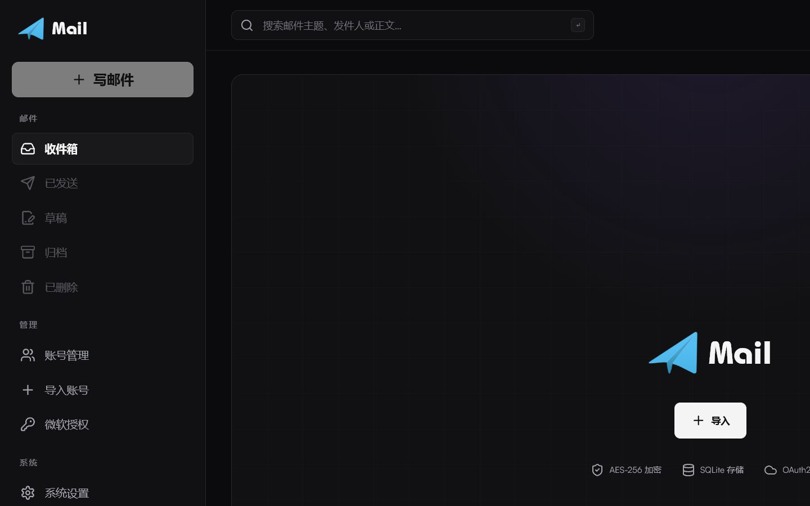
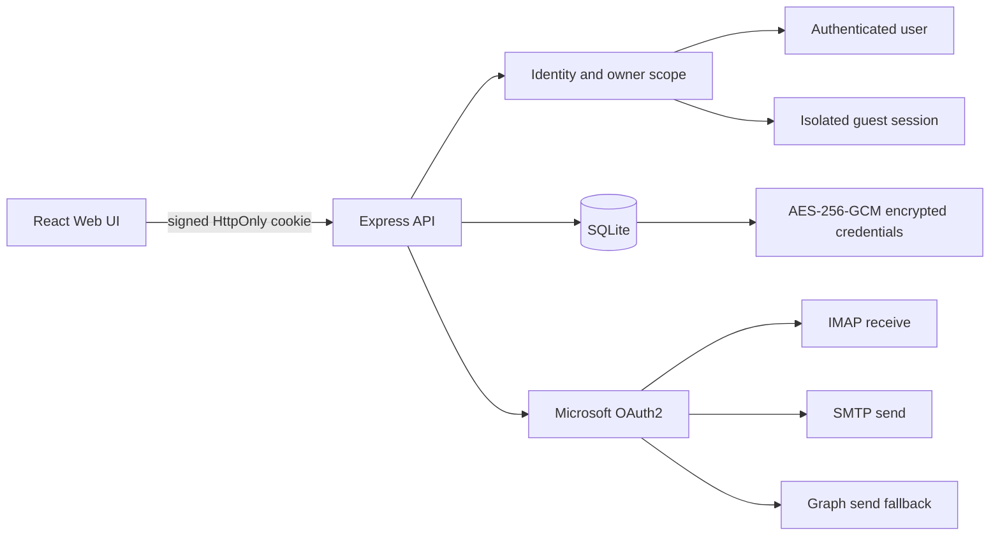

<p align="center">
  
</p>

<h1 align="center">Mail</h1>

<p align="center">
  A secure, multi-user web workspace for Outlook, Hotmail, and Live mailboxes.
</p>

<p align="center">
  <a href="README.md">English</a> ·
  <a href="README.zh-CN.md">简体中文</a>
</p>

<p align="center">
  
  
  
  
  
</p>



Mail is a self-hosted mailbox manager for receiving, reading, and sending email across Outlook, Hotmail, and Live accounts. It combines Microsoft OAuth2, IMAP, SMTP, and Microsoft Graph with an encrypted SQLite data layer and a responsive interface inspired by the visual language of [wr.do](https://github.com/oiov/wr.do).

The project is designed around privacy boundaries: every account belongs to an authenticated user or an isolated guest session, credentials are encrypted before persistence, cookies never contain mailbox passwords or tokens, and remote tracking resources in email HTML are blocked by default.

## Highlights

- Multi-account Outlook, Hotmail, and Live mailbox management.
- IMAP XOAUTH2 receiving with folder, list, search, and message-body views.
- SMTP OAuth2 sending with Microsoft Graph `Mail.Send` fallback.
- Multi-user registration with strict owner-scoped SQLite queries.
- Receive-only guest mode with a long-lived, signed HttpOnly cookie.
- Automatic guest-to-user account migration after sign-in or registration.
- AES-256-GCM encryption for passwords, Client IDs, and refresh tokens.
- Chinese and English interfaces with local Bahamas Bold and Satoshi fonts.
- Responsive desktop, tablet, and mobile layouts with light and dark themes.
- Docker deployment, production security gates, rate limits, and regression tests.

## Screenshots

| Sign in | Email-verified registration |
| --- | --- |
|  |  |
| Mail workspace | Account management |
|  |  |
| System settings | |
|  | |

The navigation follows a structured mailbox workflow:

- **Mail:** Inbox, Sent, Drafts, Archive, Trash.
- **Manage:** Accounts, account import, Microsoft authorization.
- **System:** Security settings and interface language.

## Architecture



### Mail transport

| Capability | Primary path | Fallback / behavior |
| --- | --- | --- |
| Receive | IMAP XOAUTH2 | Explicit Outlook IMAP resource scope |
| Send | SMTP OAuth2 | Microsoft Graph `Mail.Send` when SMTP AUTH is disabled |
| Token lifecycle | OAuth2 refresh token | Rotated tokens are encrypted and persisted immediately |
| Message HTML | Sanitized sandbox iframe | Scripts and remote tracking resources are blocked |

### Data isolation

Every account row has an `owner_key` such as `user:<id>` or `guest:<id>`. List, read, update, delete, token rotation, and sync operations always include that owner scope. Guest credentials remain encrypted on the server; the browser receives only a signed session identifier.

## Quick Start

### Requirements

- Node.js 24+
- npm 11+
- Network access to Microsoft OAuth2, IMAP, SMTP, and Graph endpoints

```bash
git clone <your-repository-url>
cd Mail
npm install
npm run dev
```

Open [http://localhost:5173](http://localhost:5173).

When the database has no users, Mail automatically opens a one-time administrator setup screen. Enter an administrator username, email address, and a password of at least 12 characters, then confirm the six-digit code delivered by email. The code expires after five minutes, and the setup endpoint closes permanently after success.

Configure `MAIL_VERIFICATION_SMTP_*` in `.env` before requesting a code. The API binds to `127.0.0.1` by default.

## Account Import

Import one account per line with either a real Tab separator or four hyphens:

```text
email<TAB>password<TAB>client_id<TAB>refresh_token
email----password----client_id----refresh_token
```

The password field is retained for compatibility with existing account exports. Mail transport uses OAuth2 access tokens derived from the Client ID and refresh token.

## Microsoft Authorization

The built-in Device Code flow requests the permissions required by the hybrid transport:

```text
https://outlook.office.com/IMAP.AccessAsUser.All
https://outlook.office.com/SMTP.Send
https://graph.microsoft.com/Mail.Send
offline_access
```

Some Outlook mailboxes disable SMTP AUTH even when `SMTP.Send` is present. In that case, Mail automatically attempts Microsoft Graph delivery.

## Guest Mode

Guest mode is intended for temporary or device-local receiving workflows:

- Guests can import up to three mailboxes and receive/read messages.
- Guests cannot send email; the API enforces this with `403 GUEST_SEND_DISABLED`.
- The guest cookie is signed, HttpOnly, SameSite=Strict, and renewed while in use.
- Passwords and tokens are never stored in cookies.
- Signing in or registering transfers guest accounts into the user's private namespace and invalidates the old guest session.
- Explicit sign-out deletes the guest cache immediately.

## Production Deployment

Create a `.env` file from the template and provide strong secrets:

```bash
cp .env.example .env
npm run build
npm start
```

Required production values:

| Variable | Purpose | Requirement |
| --- | --- | --- |
| `MAIL_SESSION_SECRET` | Cookie signature key | 32+ characters |
| `MAIL_ENCRYPTION_KEY` | AES-256 credential key | 32-byte Base64 or 64-char hex |
| `MAIL_VERIFICATION_SMTP_HOST` | Verification SMTP host | Required in production |
| `MAIL_VERIFICATION_SMTP_PORT` | Verification SMTP port | Defaults to `587` |
| `MAIL_VERIFICATION_SMTP_SECURE` | SMTP TLS mode | Usually `1` for port 465 |
| `MAIL_VERIFICATION_SMTP_USER` | SMTP username | Configure together with password |
| `MAIL_VERIFICATION_SMTP_PASSWORD` | SMTP password or app password | Store as a secret |
| `MAIL_VERIFICATION_FROM` | Verification sender address | Required in production |
| `HOST` | API bind address | `127.0.0.1` by default |
| `PORT` | API port | `3000` in production |
| `MAIL_DATA_DIR` | SQLite data directory | Defaults to `./data` |
| `MAIL_TRUST_PROXY` | Trust one reverse-proxy hop | Set to `1` only behind a trusted proxy |

Generate an encryption key:

```bash
openssl rand -base64 32
```

### Docker Compose

```bash
export MAIL_SESSION_SECRET='replace-with-a-long-random-session-secret'
export MAIL_ENCRYPTION_KEY="$(openssl rand -base64 32)"
export MAIL_VERIFICATION_SMTP_HOST='smtp.example.com'
export MAIL_VERIFICATION_SMTP_USER='mail@example.com'
export MAIL_VERIFICATION_SMTP_PASSWORD='replace-with-an-smtp-app-password'
export MAIL_VERIFICATION_FROM='Mail <mail@example.com>'
docker compose up -d --build
```

Docker Compose refuses to start when required secrets are missing. The runtime container uses the non-root `node` user.

## Security Model

- Owner-scoped account CRUD prevents cross-user mailbox access.
- User sessions are validated against a server-side session table and can be revoked.
- Guest sessions are server-side records referenced by signed cookies.
- Email addresses, passwords, Client IDs, and refresh tokens use AES-256-GCM authenticated encryption; email deduplication uses a blind HMAC index.
- API responses use `Cache-Control: no-store`.
- First deployment uses a one-time administrator setup. Later registrations require a five-minute email code, allow at most five wrong attempts, and enforce a 60-second resend cooldown.
- Production startup requires strong session and encryption secrets plus a configured verification SMTP service.
- Email HTML is sanitized and rendered with sandbox and iframe CSP restrictions.
- Remote HTTP images are removed to block tracking pixels.
- Main responses include CSP, frame protection, no-referrer, MIME protection, and permissions policy headers.
- Authentication and sending endpoints use rate limits and account quotas.

See [SECURITY.md](SECURITY.md) for deployment guidance and vulnerability reporting.

> [!IMPORTANT]
> Never paste real mailbox passwords or refresh tokens into public issues, commits, screenshots, or chat transcripts. If a credential is exposed, rotate the password and revoke/re-authorize the refresh token immediately.

## Repository Layout

```text
Mail/
├── server/                 # Express API, SQLite, auth, OAuth2, IMAP/SMTP/Graph
├── src/                    # React interface, dialogs, localization, styles
├── public/                 # Brand assets and local fonts
├── docs/images/            # GitHub preview screenshots
├── data/                   # Runtime SQLite and local development key (ignored)
├── Dockerfile
├── docker-compose.yml
├── README.md
└── README.zh-CN.md
```

## Development and Tests

```bash
npm run dev        # Start Vite and the API in watch mode
npm run typecheck  # Type-check the client and server
npm test           # Parser, encryption, and tenant-isolation tests
npm run build      # Build the production client and server
npm start          # Start the built server
npm audit          # Review dependency vulnerabilities
```

Current regression coverage includes:

- Tab and `----` account import parsing.
- Cross-owner list, read, update, and delete isolation.
- Guest-to-user account transfer and guest cleanup.
- AES-GCM ciphertext verification.
- One-time administrator bootstrap, five-minute verification expiry, attempt limits, and encrypted registration email storage.
- Dynamic API checks for guest send denial, cookie replay denial, and tenant separation.

## Project Status

Mail is suitable for self-hosted personal and small-team mailbox management when deployed behind HTTPS with strong external secrets. It is not a Microsoft product and is not affiliated with Microsoft.

Planned improvements:

- Attachment download with explicit malware-safe handling.
- Per-user audit log and active-session management.
- Optional SQLCipher or external database storage.
- Mail rules, labels, contacts, and reusable compose templates.
- Mocked Microsoft transport integration tests for offline CI.

## Acknowledgements

- [CN-Root/OutlookPanel](https://github.com/CN-Root/OutlookPanel) for the four-field import and Outlook OAuth2 workflow reference.
- [oiov/wr.do](https://github.com/oiov/wr.do) for dashboard layout and visual-language inspiration.
- [amine123max/OceanSim](https://github.com/amine123max/OceanSim) for the release-oriented README structure.

## Contributing

Contributions are welcome. Read [CONTRIBUTING.md](CONTRIBUTING.md) before opening a pull request.

## License

Released under the [MIT License](LICENSE).
