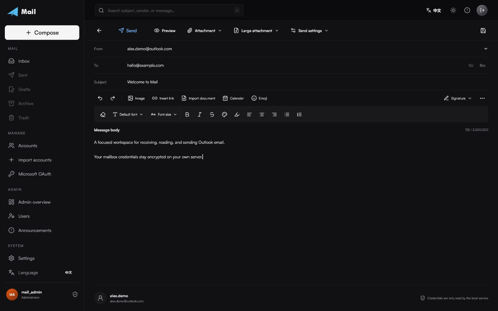
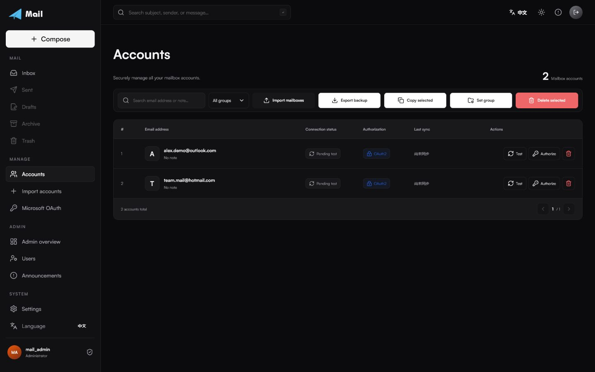
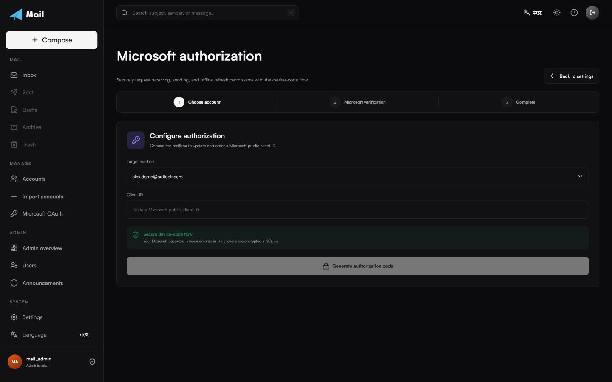
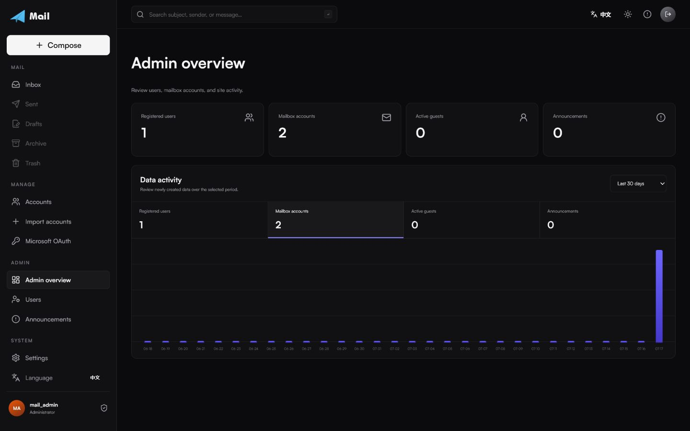
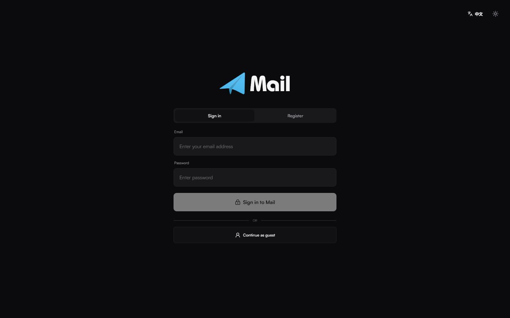
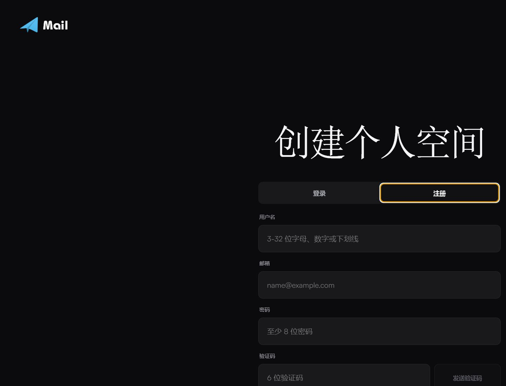
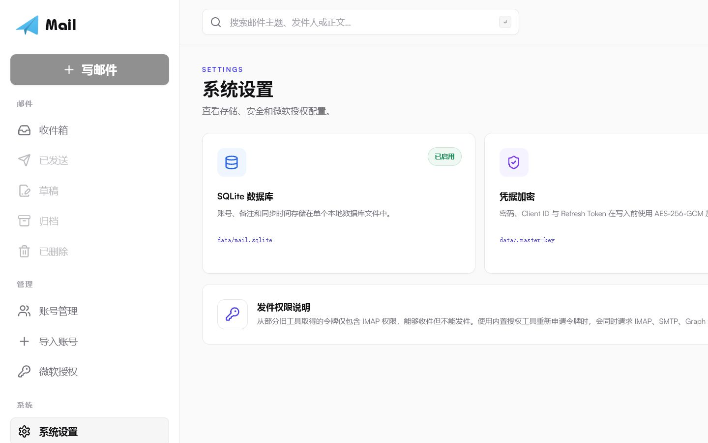
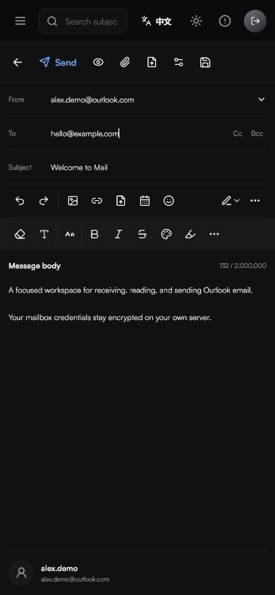
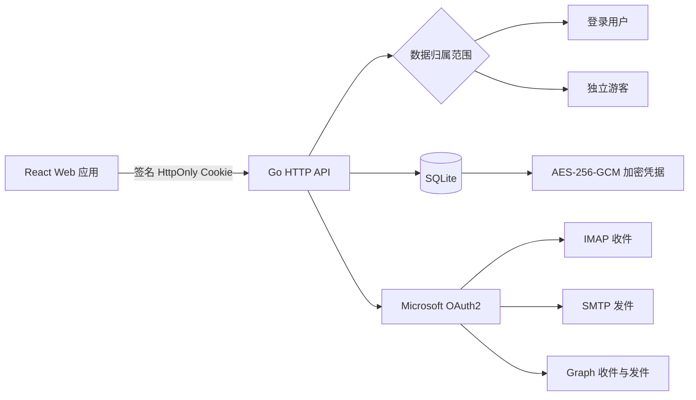

<p align="center">
  
</p>

<h1 align="center">Mail</h1>

<p align="center">
  私有部署、支持多用户的 Outlook、Hotmail 与 Live 邮箱工作台。
</p>

<p align="center">
  <a href="https://www.aillive.xyz/mail/"><strong>在线体验</strong></a>
  ·
  <a href="README.md">English</a>
  ·
  <a href="SECURITY.md">安全说明</a>
  ·
  <a href="CONTRIBUTING.md">参与贡献</a>
</p>

<p align="center">
  <a href="https://github.com/amine123max/Mail/actions/workflows/ci.yml"></a>
  
  
  
  
  
</p>



Mail 将多邮箱收件、阅读、整理和发件集中在一个响应式 Web 应用中。项目组合 Microsoft OAuth2、IMAP、SMTP、Microsoft Graph 与按用户隔离的 SQLite 数据层，邮箱凭据无需交给第三方服务。

界面针对桌面端与手机端分别优化，支持中英文、浅色与深色主题，并提供用户、站点活动和公告管理功能。

生产环境仅运行一个 Go 二进制文件，同时提供 API 与编译后的 React 页面。Node.js 仅用于构建前端，原 Express 与 TypeScript 后端已经完全移除。

## 为什么选择 Mail

| | 功能 | 说明 |
| --- | --- | --- |
| ✉️ | 统一邮箱工作台 | 多账号收件箱、已发送、草稿、归档、已删除、搜索与邮件正文阅读。 |
| 🔐 | 私有数据存储 | 密码、Client ID 与 Refresh Token 写入 SQLite 前使用 AES-256-GCM 加密。 |
| 🚀 | 混合 OAuth2 传输 | IMAP XOAUTH2 与 Microsoft Graph 收件，并通过 SMTP OAuth2 与 Graph 自动回退发件。 |
| 👥 | 多用户严格隔离 | 所有数据库操作均绑定登录用户或独立游客会话。 |
| 🧭 | 完整账号流程 | 批量导入导出、分组、排序、连接测试、删除与设备代码授权。 |
| 📱 | 响应式界面 | 桌面与手机布局、可拖动邮件分栏、主题切换和中英文界面。 |
| 🛡️ | 管理员工作区 | 首次部署管理员配置、用户管理、数据活动与公告推送。 |
| 🍪 | 持久游客模式 | 只允许收件的游客会话通过签名 HttpOnly Cookie 在浏览器中保持。 |

## 产品预览

所有截图均使用虚构演示数据，不包含生产环境邮箱、令牌或用户信息。

### 账号管理



### 专注发信工作区


### 微软授权



### 管理员总览



<table>
  <tr>
    <th>安全登录</th>
    <th>验证码注册</th>
  </tr>
  <tr>
    <td></td>
    <td></td>
  </tr>
  <tr>
    <th>系统设置</th>
    <th>手机端发信</th>
  </tr>
  <tr>
    <td></td>
    <td align="center"></td>
  </tr>
</table>

## 系统架构



### 邮件传输

| 操作 | 主要方式 | 回退 / 行为 |
| --- | --- | --- |
| 收件 | TLS IMAP + XOAUTH2 | IMAP 不可用时回退 Microsoft Graph `Mail.ReadWrite` |
| 发件 | STARTTLS SMTP + OAuth2 | SMTP AUTH 不可用时使用 Microsoft Graph `Mail.Send` |
| Token 刷新 | Microsoft Refresh Token | 轮换后的 Token 立即加密写回 |
| HTML 正文 | 服务端安全清理 | 阻止脚本、不安全 URL、CSS 外链、私网请求与远程跟踪资源 |

### 数据隐私边界

- 每条邮箱记录都包含 `user:<id>` 或 `guest:<id>` 形式的 `owner_key`。
- 列表、读取、更新、删除、同步、标记、移动与导出操作必须包含当前用户范围。
- Cookie 仅包含签名会话标识，不包含邮箱密码、Client ID 或 Refresh Token。
- 邮箱凭据写入 SQLite 前进行加密。
- 游客登录或注册后，可将游客邮箱迁移到个人数据空间。
- 原生邮件 HTML 在服务端清理；允许的远程图片通过带 SSRF 防护的代理获取并转换为本地 Data URL。

## 快速开始

### 环境要求

- Go 1.26.5+
- Node.js 24+ 与 npm 11+（用于构建 React 前端）
- 能访问 Microsoft OAuth2、Outlook IMAP/SMTP 与 Microsoft Graph

```bash
git clone https://github.com/amine123max/Mail.git
cd Mail
npm ci
cp .env.example .env
npm run dev
```

打开 [http://localhost:5173](http://localhost:5173)。

使用空数据库首次启动时，Mail 会进入一次性管理员配置页面。请先在 `.env` 中配置验证码 SMTP，然后填写管理员邮箱、显示名称、密码和六位验证码。验证码有效期为五分钟。

## 环境变量

| 变量 | 用途 | 生产环境建议 |
| --- | --- | --- |
| `MAIL_SESSION_SECRET` | 签名登录与游客 Cookie | 必填，至少使用 32 位随机字符 |
| `MAIL_ENCRYPTION_KEY` | 加密邮箱凭据 | 必填，32 字节 Base64 或 64 位十六进制 |
| `MAIL_DATA_DIR` | SQLite 与本地数据目录 | 挂载持久且私有的目录 |
| `MAIL_VERIFICATION_SMTP_HOST` | 验证码 SMTP 地址 | 注册与首次部署必填 |
| `MAIL_VERIFICATION_SMTP_PORT` | 验证码 SMTP 端口 | 通常为 `587` 或 `465` |
| `MAIL_VERIFICATION_SMTP_SECURE` | 直接 TLS 模式 | 端口 `465` 使用 `1`，否则使用 `0` |
| `MAIL_VERIFICATION_SMTP_USER` | 验证码 SMTP 用户名 | 作为部署密钥保存 |
| `MAIL_VERIFICATION_SMTP_PASSWORD` | SMTP 密码 / 授权码 | 作为部署密钥保存 |
| `MAIL_VERIFICATION_FROM` | 验证码发件人 | 生产环境必填 |
| `VITE_BASE_PATH` | 前端部署路径 | `/` 或 `/mail/` 等子路径 |
| `MAIL_COOKIE_PATH` | 会话 Cookie 范围 | 与部署路径一致，例如 `/mail` |
| `HOST` / `PORT` | API 监听地址与端口 | 反向代理后建议仅监听本机 |
| `MAIL_TRUST_PROXY` | 信任代理请求头 | 仅位于可信反向代理后时设置为 `1` |

生成加密密钥：

```bash
openssl rand -base64 32
```

## 导入邮箱账号

每行导入一个邮箱。支持真实 Tab 分隔符或四个短横线：

```text
邮箱<TAB>密码<TAB>Client ID<TAB>Refresh Token
邮箱----密码----Client ID----Refresh Token
```

密码字段用于兼容已有导入与导出格式。实际邮件传输使用由 Client ID 和 Refresh Token 获取的 OAuth2 Access Token。

## 微软授权

内置设备代码授权流程会请求混合传输所需权限：

```text
https://outlook.office.com/IMAP.AccessAsUser.All
https://outlook.office.com/Mail.ReadWrite
https://outlook.office.com/SMTP.Send
https://graph.microsoft.com/Mail.ReadWrite
https://graph.microsoft.com/Mail.Send
offline_access
```

Mail 不会要求用户在应用中输入微软密码。用户在微软验证页面完成授权后，得到的 Token 会在本地加密保存。

## 页面路径

英文路径支持直接访问、刷新和浏览器前进后退：

| 路径 | 页面 |
| --- | --- |
| `/inbox` | 收件箱 |
| `/sent` | 已发送 |
| `/drafts` | 草稿 |
| `/archive` | 归档 |
| `/trash` | 已删除 |
| `/sendmails` | 发信工作区 |
| `/accounts` | 账号管理 |
| `/import` | 导入账号 |
| `/oauth` | 登录与注册 |
| `/microsoft-oauth` | 微软邮箱授权 |
| `/settings` | 系统设置 |
| `/admin` | 管理员总览 |

部署在 `/mail` 子路径时，对应地址为 `/mail/oauth`、`/mail/inbox`、`/mail/microsoft-oauth` 等。未登录访问 `/mail/` 会自动跳转到 `/mail/oauth`。

## 生产环境部署

```bash
npm ci
VITE_BASE_PATH=/mail/ npm run build
NODE_ENV=production MAIL_WEB_ROOT=./dist ./build/mail-server
```

Docker 部署：

```bash
docker compose up -d --build
```

使用 Nginx 部署到 `/mail` 时，构建环境设置 `VITE_BASE_PATH=/mail/`，设置 `MAIL_COOKIE_PATH=/mail`，并保留 `proxy_pass` 末尾的 `/`：

```nginx
location = /mail {
  return 301 /mail/;
}

location /mail/ {
  proxy_pass http://127.0.0.1:3000/;
  proxy_set_header Host $host;
  proxy_set_header X-Forwarded-Proto $scheme;
  proxy_set_header X-Forwarded-For $proxy_add_x_forwarded_for;
}
```

不要提交 `.env`、SQLite 文件、主密钥、备份、密码或邮箱 Token。

## 验证项目

```bash
npm test
npm run vet
npm run typecheck
npm run build
npm run audit
```

回归测试覆盖 Node 兼容密码与加密格式、旧 SQLite 迁移、账号隔离与游客迁移、导入导出、浏览器路径、SMTP/IMAP XOAUTH2、Graph 请求映射、五分钟验证码邮件、安全 MIME/HTML 渲染与 SSRF 边界。

## 项目结构

```text
Mail/
├── server/              完整 Go 后端
│   ├── cmd/mail/        生产服务入口
│   ├── cmd/bootstrap-admin/
│   ├── internal/        身份、HTTP API、SQLite、加密、IMAP、SMTP 与 Graph
│   ├── go.mod
│   └── go.sum
├── src/                 React 应用与响应式界面
├── public/              品牌资源与本地字体
├── docs/images/         已脱敏 README 截图
├── go.work              指向 server/ 的 Go 工作区
├── Dockerfile
├── docker-compose.yml
└── .env.example
```

## 安全说明

公开部署前请阅读 [SECURITY.md](SECURITY.md)。发现安全问题时请私下报告，不要在公开 Issue 中提交凭据、Token、日志或邮件内容。

Windows 客户端的信任边界、防护措施与剩余发布风险见 [docs/desktop-threat-model.md](docs/desktop-threat-model.md)。

## 开源协议
感谢 [LINUX DO](https://linux.do/) 开源社区提供交流与分享平台。
