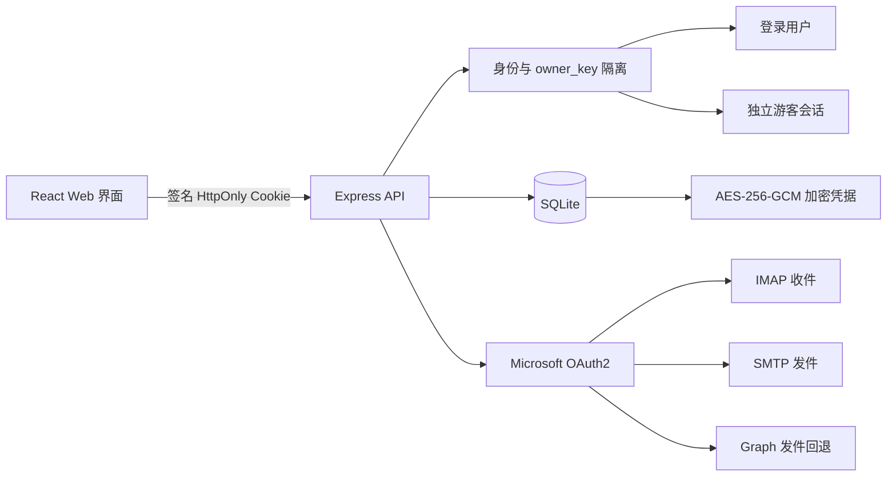

<p align="center">
  
</p>

<h1 align="center">Mail</h1>

<p align="center">安全、支持多用户的 Outlook / Hotmail / Live 邮箱工作台。</p>

<p align="center">
  <a href="README.md">English</a> ·
  <a href="README.zh-CN.md">简体中文</a>
</p>

<p align="center">
  
  
  
  
  
</p>


Mail 是一个可自托管的 Outlook、Hotmail 与 Live 邮箱管理项目，支持统一收件、阅读和发件。项目将 Microsoft OAuth2、IMAP、SMTP、Microsoft Graph、加密 SQLite 数据层与响应式 Web 界面组合在一起，视觉语言参考了 [wr.do](https://github.com/oiov/wr.do)。

项目以隐私边界为核心：每个邮箱账号都属于一个登录用户或隔离的游客会话；凭据写入数据库前会加密；Cookie 不包含邮箱密码或令牌；邮件 HTML 中的远程跟踪资源默认被阻止。

## 核心特性

- 统一管理多个 Outlook、Hotmail 与 Live 邮箱。
- IMAP XOAUTH2 收件、文件夹、搜索、列表和正文阅读。
- SMTP OAuth2 发件，SMTP AUTH 被禁用时自动回退到 Graph `Mail.Send`。
- 多用户注册，所有数据库操作强制绑定当前用户身份。
- 只允许收件的游客模式，使用长期签名 HttpOnly Cookie。
- 游客登录或注册后，账号自动迁移到个人数据空间。
- 密码、Client ID、Refresh Token 使用 AES-256-GCM 加密。
- 中文 / English 界面、本地 Bahamas Bold 与 Satoshi 字体。
- 浅色/深色主题，桌面、平板、移动端响应式布局。
- Docker 部署、生产安全检查、限流、配额与隔离回归测试。

## 截图预览

| 登录页 | 邮箱验证码注册 |
| --- | --- |
|  |  |
| 邮箱工作台 | 账号管理 |
|  |  |
| 系统设置 | |
|  | |

侧栏按真实邮箱工作流分组：

- **邮件：** 收件箱、已发送、草稿、归档、已删除。
- **管理：** 账号管理、导入账号、微软授权。
- **系统：** 安全设置与界面语言。

## 系统架构



### 邮件传输

| 能力 | 主路径 | 回退 / 行为 |
| --- | --- | --- |
| 收件 | IMAP XOAUTH2 | 显式请求 Outlook IMAP 资源 scope |
| 发件 | SMTP OAuth2 | SMTP AUTH 关闭时使用 Graph `Mail.Send` |
| Token 生命周期 | OAuth2 Refresh Token | 轮换后的 Token 立即加密写回 SQLite |
| 邮件 HTML | 清理后的 sandbox iframe | 禁止脚本和远程跟踪资源 |

### 数据隔离

每条账号记录都有 `user:<id>` 或 `guest:<id>` 形式的 `owner_key`。账号列表、读取、更新、删除、Token 轮换和同步操作都必须包含该身份范围。游客凭据加密保存在服务端，浏览器只收到签名会话标识。

## 快速开始

### 环境要求

- Node.js 24+
- npm 11+
- 能访问 Microsoft OAuth2、IMAP、SMTP 和 Graph 服务

```bash
git clone <你的仓库地址>
cd Mail
npm install
npm run dev
```

访问 [http://localhost:5173](http://localhost:5173)。

首次启动时数据库中没有用户，页面会自动进入一次性管理员初始化。填写管理员用户名、邮箱和至少 12 位密码，并输入邮件收到的 6 位验证码即可完成配置。验证码仅在 5 分钟内有效；初始化成功后该入口永久关闭。

发送验证码前需要在 `.env` 中配置 `MAIL_VERIFICATION_SMTP_*`。API 默认只绑定 `127.0.0.1`。

## 账号导入

每行一个账号，使用真实 Tab 或四个横线分隔：

```text
邮箱<TAB>密码<TAB>Client ID<TAB>Refresh Token
邮箱----密码----Client ID----Refresh Token
```

密码字段用于兼容已有账号导出格式；实际邮件传输通过 Client ID 与 Refresh Token 换取 OAuth2 Access Token。

## 微软授权

内置 Device Code 授权会请求混合收发链路所需权限：

```text
https://outlook.office.com/IMAP.AccessAsUser.All
https://outlook.office.com/SMTP.Send
https://graph.microsoft.com/Mail.Send
offline_access
```

部分 Outlook 邮箱即使拥有 `SMTP.Send`，服务端仍会关闭 SMTP AUTH。Mail 会自动尝试 Microsoft Graph 发件。

## 游客模式

- 游客最多导入 3 个邮箱，仅支持收件和阅读。
- 游客发件会被后端拒绝并返回 `403 GUEST_SEND_DISABLED`。
- 游客 Cookie 采用签名、HttpOnly、SameSite=Strict，并在使用时续期。
- 邮箱密码、Client ID、Refresh Token 和邮件正文不会写入 Cookie。
- 游客登录或注册后，账号会迁移到个人空间，旧游客会话立即失效。
- 主动退出会立即删除游客缓存。

## 生产部署

复制配置模板并提供强密钥：

```bash
cp .env.example .env
npm run build
npm start
```

生产环境必填配置：

| 环境变量 | 用途 | 要求 |
| --- | --- | --- |
| `MAIL_SESSION_SECRET` | Cookie 签名密钥 | 至少 32 位 |
| `MAIL_ENCRYPTION_KEY` | AES-256 凭据密钥 | 32 字节 Base64 或 64 位十六进制 |
| `MAIL_VERIFICATION_SMTP_HOST` | 验证码 SMTP 主机 | 生产环境必填 |
| `MAIL_VERIFICATION_SMTP_PORT` | 验证码 SMTP 端口 | 默认 `587` |
| `MAIL_VERIFICATION_SMTP_SECURE` | SMTP TLS 模式 | 端口 465 通常设为 `1` |
| `MAIL_VERIFICATION_SMTP_USER` | SMTP 用户名 | 与密码成对配置 |
| `MAIL_VERIFICATION_SMTP_PASSWORD` | SMTP 密码或应用密码 | 使用 Secret 管理 |
| `MAIL_VERIFICATION_FROM` | 验证码发件地址 | 生产环境必填 |
| `VITE_BASE_PATH` | 前端构建子路径 | 根路径用 `/`，子路径示例 `/mail/` |
| `MAIL_COOKIE_PATH` | 会话 Cookie 路径 | 应与部署子路径一致，如 `/mail` |
| `MAIL_BIND_PORT` | Docker 仅本机监听端口 | 默认 `3000` |
| `HOST` | API 监听地址 | 默认 `127.0.0.1` |
| `PORT` | API 端口 | 生产默认 `3000` |
| `MAIL_DATA_DIR` | SQLite 数据目录 | 默认 `./data` |
| `MAIL_TRUST_PROXY` | 信任一层反向代理 | 仅在可信代理后设为 `1` |

生成加密密钥：

```bash
openssl rand -base64 32
```

### Docker Compose

```bash
export MAIL_SESSION_SECRET='替换为足够长的随机会话密钥'
export MAIL_ENCRYPTION_KEY="$(openssl rand -base64 32)"
export MAIL_VERIFICATION_SMTP_HOST='smtp.example.com'
export MAIL_VERIFICATION_SMTP_USER='mail@example.com'
export MAIL_VERIFICATION_SMTP_PASSWORD='替换为 SMTP 应用密码'
export MAIL_VERIFICATION_FROM='Mail <mail@example.com>'
docker compose up -d --build
```

缺少必填 secret 时 Docker Compose 会拒绝启动；运行容器使用非 root 的 `node` 用户。

首次部署也可以通过一次性标准输入创建管理员：

```bash
printf '%s' '{"username":"admin","email":"admin@example.com","password":"replace-with-a-strong-password"}' \
  | docker compose exec -T mail npm run bootstrap-admin
```

通过 Nginx 部署到 `/mail` 时，应让 `location /mail/` 使用带尾斜杠的 `proxy_pass http://127.0.0.1:3000/;`，由代理移除外部子路径。

## 安全模型

- 所有账号 CRUD 都带 `owner_key`，阻止跨用户读取。
- 用户 Cookie 同时受签名与服务端 session 表校验，可立即吊销。
- 游客 Cookie 只引用服务端游客会话，不包含邮箱凭据。
- 邮箱地址、密码、Client ID 和 Refresh Token 使用 AES-256-GCM 认证加密；邮箱去重使用不可逆 HMAC 盲索引。
- API 响应使用 `Cache-Control: no-store`。
- 首次部署使用一次性管理员初始化；普通注册必须通过邮件验证码，验证码 5 分钟有效、连续错误 5 次作废、60 秒内不可重复发送。
- 生产启动强制要求会话密钥、加密密钥和验证码 SMTP 服务。
- 邮件 HTML 经过清理，并受 iframe sandbox 与 CSP 限制。
- 远程 HTTP 图片默认移除，阻止跟踪像素泄露 IP 和阅读状态。
- 主页面包含 CSP、禁止嵌入、no-referrer、MIME 与权限策略响应头。
- 登录、注册和发件接口带限流，游客与用户带账号配额。

更多部署说明见 [SECURITY.md](SECURITY.md)。

> [!IMPORTANT]
> 不要在公开 Issue、提交、截图或聊天记录中粘贴真实邮箱密码和 Refresh Token。凭据一旦暴露，应立即修改密码并撤销、重新授权 Token。

## 项目结构

```text
Mail/
├── server/                 # Express、SQLite、鉴权、OAuth2、IMAP/SMTP/Graph
├── src/                    # React 界面、弹窗、多语言和样式
├── public/                 # 品牌资源与本地字体
├── docs/images/            # GitHub 界面预览图
├── data/                   # 运行数据库和开发密钥（已忽略）
├── Dockerfile
├── docker-compose.yml
├── README.md
└── README.zh-CN.md
```

## 开发与测试

```bash
npm run dev        # 启动 Vite 与 API 监听模式
npm run typecheck  # 检查前后端 TypeScript
npm test           # 导入、加密和多租户隔离测试
npm run build      # 构建生产前后端
npm start          # 启动构建后的服务
npm audit          # 检查依赖漏洞
```

当前回归测试覆盖：

- Tab 与 `----` 导入解析。
- 跨 owner 列表、读取、更新、删除隔离。
- 游客到用户的账号迁移与游客清理。
- AES-GCM 密文验证。
- 一次性管理员初始化、验证码 5 分钟过期、错误次数限制和注册邮箱加密存储。
- 游客禁发、Cookie 重放失效和多用户隔离动态检查。

## 项目状态与路线图

Mail 适用于配置 HTTPS、强外部密钥后的个人或小团队自托管邮箱管理。项目不是 Microsoft 官方产品，也不隶属于 Microsoft。

计划功能：

- 安全的附件下载与处理。
- 用户安全审计日志和活动会话管理。
- 可选 SQLCipher 或外部数据库。
- 邮件规则、标签、联系人与写信模板。
- Microsoft 传输层 Mock 集成测试。

## 致谢

- [CN-Root/OutlookPanel](https://github.com/CN-Root/OutlookPanel)：四字段导入和 Outlook OAuth2 流程参考。
- [oiov/wr.do](https://github.com/oiov/wr.do)：后台布局与视觉语言参考。
- [amine123max/OceanSim](https://github.com/amine123max/OceanSim)：GitHub 发布型 README 结构参考。

## 参与贡献

欢迎提交贡献。请在发起 Pull Request 前阅读 [CONTRIBUTING.md](CONTRIBUTING.md)。

## 许可证

项目采用 [MIT License](LICENSE)。
